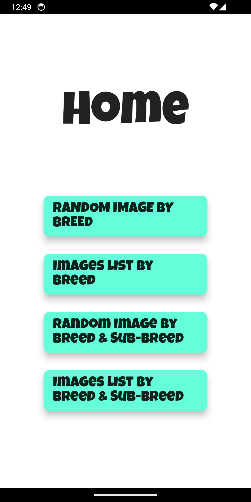
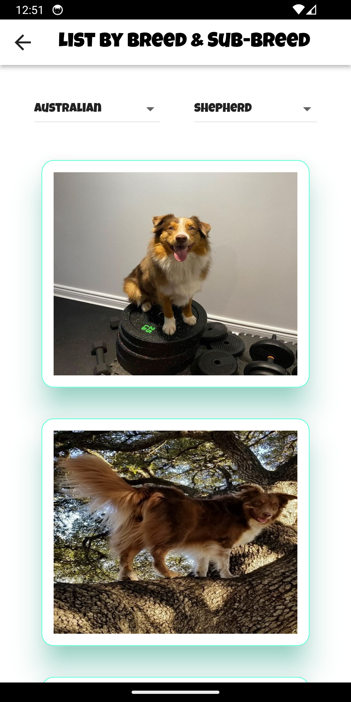

# deliveristo_flutter_challenge

This Flutter project provides a dashboard for displaying images of dogs. It allows users to view random images of dogs by breed and sub-breed, as well as a list of images by breed and sub-breed.

## Features

### Random Image by Breed
Users can select a breed and view a random image of a dog from that breed.

### Images List by Breed
Users can select a breed and view a list of images of dogs from that breed.

### Random Image by Breed and Sub-Breed
Users can select a breed and a sub-breed (if available) and view a random image of a dog from that specific category.

### Images List by Breed and Sub-Breed
Users can select a breed and a sub-breed (if available) and view a list of images of dogs from that specific category.

## Architecture

The project follows the **Model-View-ViewModel (MVVM)** architecture. This architecture separates the business logic and data layer from the user interface, making the code more maintainable and testable.

### Model
Represents the data and business logic of the application.

### View
Represents the UI of the application. It observes the ViewModel.

### ViewModel
Acts as a link between the Model and the View. It handles the business logic and provides data to the View.

## Code Quality

The codebase adheres to best practices in Flutter development, ensuring readability, scalability, and maintainability. The project uses:

- **Dio**: For making network requests.
- **Riverpod**: For state management and dependency injection.
- **Logger**: For logging and debugging.

## Testing

The project includes unit tests and integration tests to ensure the reliability and performance of the application. Tests cover critical functionalities, end-to-end user flow and components.

## CI/CD

The project includes CI/CD configuration for automated building, testing, and artifact generation for Android, Web, and Windows platforms. This ensures that every change in the codebase is automatically tested and verified, maintaining the overall quality of the application.

## Screenshots

## How to Run

1. Clone the repository.
2. Navigate to the project directory.
3. Run `flutter pub get` to install dependencies.
4. Run `flutter run` to start the application.
